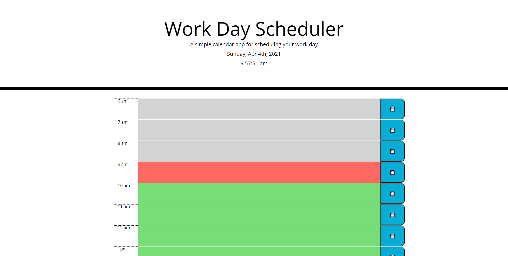

# Work Day Schedule 

## Description

A simple work Day scheduler application. It allows a user to plan their daily works, save events and tasks for each hour. The saved entries will be stored in local storage and will be loaded into the calendar automatically. The scheduler will update itself every hour without reloading the page.

## Features

* Extended Work hours, 6 am to 9 pm :dizzy_face: .
* Includes a simple clock.
* Automatically updates scheduler every hour.
* Past hour entries will be locked.
* Display confirmation for successfully save entries.
  
## Credit
* [jQuery](https://jquery.com/)

* [jQueryui](https://jqueryui.com/)

* [Bootstrap](https://getbootstrap.com/)

## Screenshots

* Empty scheduler.

* Entry save confirmed.

* scheduler with saved works.

## Links

[Work Day Scheduler github repository](https://github.com/realzzkevin/Work-Day-Schedule-ZZ)

[Work Day Scheduler](https://realzzkevin.github.io/Work-Day-Schedule-ZZ/)