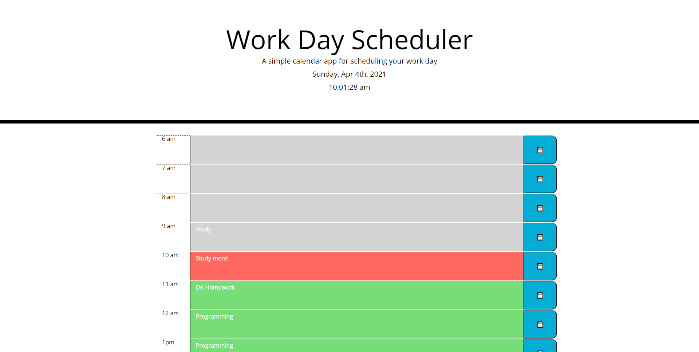

# Work Day Schedule 

## Description

## Features

* Extended Work hours, 6 am to 9pm :dizzy_face: .
* save entries in local storage.
* Includes a simple clock.
* Past hour entries will be locked.
* Display confirmation for successfully save entries.

## Credit
* [jQuery](https://jquery.com/)

* [jQueryui](https://jqueryui.com/)

* [Bootstrap](https://getbootstrap.com/)

## Screenshots

* Empty scheduler.

* Entry save confirmed.

* scheduler with saved works.

## Links

[Work Day Scheduler github repository](https://github.com/realzzkevin/Work-Day-Schedule-ZZ)

[Work Day Scheduler](https://realzzkevin.github.io/Work-Day-Schedule-ZZ/)